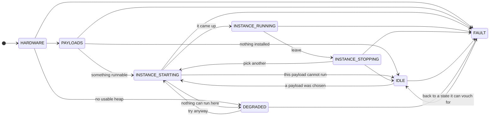
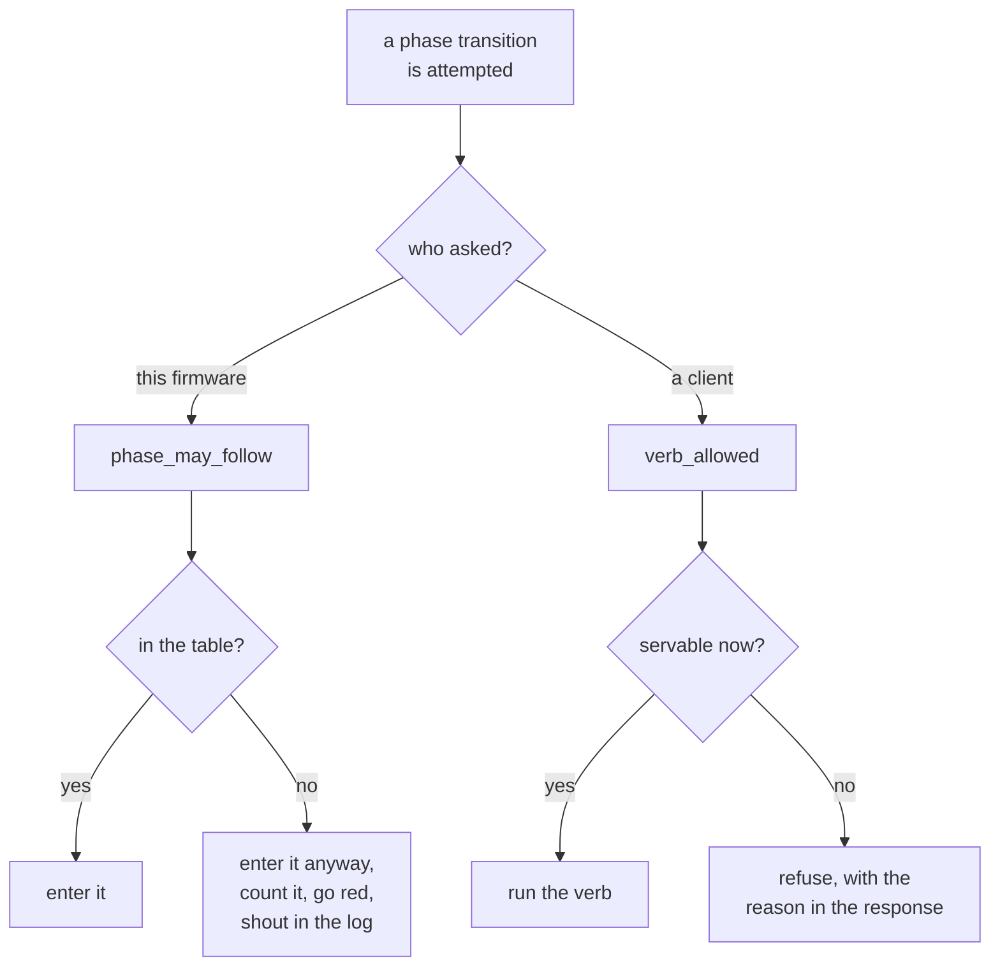

# The world state machine

How a badge gets from power-on to running an app, every way it can stop, and what it says when it does.

[`rp2350/BRINGUP.md`](../dlc-platform/embedded/rp2350/BRINGUP.md) is the runbook — *what a person does, and how
to find out what happened*. This is the firmware's own sequence: *what the world does, in what order, and what
is true at each point*. The two share a vocabulary, stated there and used here.

**Where this lives in code.** The phases are entered by `rp2350/src/main.rs` — one call each, and that is the
whole entry point. The transition table and the request gate are in `dlc-platform/embedded/src/control.rs`,
because they name no peripheral (D6a) and because that is the only place CI can execute them: CI
cross-compiles the firmware and cannot run it.

---

## Two levels, and why

A **phase** is a step of the world's life that a person would name unprompted: bring the board up, see what is
installed, start an instance from one of them, run it. A **stage** is one check within a phase.

The bring-up used to be nine stages in one flat list, run by a single ~1000-line function. Reading it, there
was no way to answer the question that actually comes up — *is this a new high-level step, or part of one that
already exists?* — because both looked identical: another entry in the same list.

Now each phase is one call in the entry point, so the entry point **is** the outline, and a new phase is a new
line there rather than a stage appended to a list.

A phase is also answerable when a stage is not. Stages come from a report that only exists once the log is up;
the phase is a single value published as the world enters it, so a client can be told `hardware, stage 4` by a
world that has not finished booting — which is exactly the world you need to ask.

---

## The sequence



**NOTHING TERMINATES, and that is the point.** There used to be a `RESTING` phase nothing followed, reached by
a function that never returned. It conflated two different things — *cannot make progress on the app flow* and
*stop executing* — and the second does not follow from the first. A badge with no usable heap can still answer
questions, show a menu, take a payload and be rebooted; halting removed all of that at exactly the moment
somebody needed it, since the heap failure is the one you most want to interrogate. The state machine had a
terminal state and the code had a diverging function, and each was the other's justification.

So every state has an exit, and a test asserts it rather than trusting the table to be read carefully.

**The three states that are not part of the forward march** are still states, not endings — and they are kept
apart by one test, which is the test any future state has to pass: **the right next action differs.**

| | what is true | what to do about it |
| --- | --- | --- |
| `IDLE` | nothing to run | supply a payload |
| `DEGRADED` | up and answering, cannot host an instance | look at the hardware — the heap |
| `FAULT` | its own bookkeeping disagrees with itself | firmware bug; capture the log |

Collapsing them would make a firmware bug look like an empty badge, and tell a board whose PSRAM never came up
to go and drag an app on.

## A DLC instance, and the three phases that are about one

**"Instance", not "session".** A session used to name two different-sized things: the phase that opened one,
and a lifetime that outlived that phase by every turn of the next. "Is a session running?" therefore had no
single answer. The instance is the thing with a lifetime — a loaded component, `_initialize` run, holding its
memory — and these three phases are what is happening to it.

| phase | the instance |
| --- | --- |
| `INSTANCE_STARTING` | being chosen, verified, instantiated, told what this world is |
| `INSTANCE_RUNNING` | in use — turns of collect, execute, show |
| `INSTANCE_STOPPING` | being dropped, and what it held accounted for |

**An instance is live from partway through `STARTING` until the drop in `STOPPING`** — so `instance_open` is
true across a phase boundary, and *between turns* an instance is open with nothing executing. That is
`ACTIVITY_COLLECTING`: loaded and waiting for you to type, not running a command.

**The edge that looks wrong and is not** is `INSTANCE_RUNNING -> INSTANCE_STOPPING -> INSTANCE_STARTING` — one
app ending and another beginning, without a power cycle. It is asserted in a test named for it.

**It runs THROUGH the teardown, and that is new.** It used to be a single edge from running back to starting,
which said an instance was replaced without saying the old one went — so a leak had no phase to be visible in.
Dropping releases 2.9 MB of an 8 MB heap, and one that leaves a few hundred KB behind hangs the badge two or
three apps later, looking like a hardware fault. A badge stuck or leaking there now reports `instance
stopping`, not `instance running`, which is the one thing it was no longer doing.

**A start that failed does not go through it** — there is no instance to tear down and no memory to account
for, so it goes straight to waiting.

**`FAULT` recovers to `IDLE`, never straight back into the march.** A world that has just admitted it cannot
say where it is has no business asserting a position; `IDLE` is the state it can vouch for — nothing
instantiated, nothing running, waiting.

### Why a table and not a comment

The phase used to be **set**, not **entered**: whatever a caller passed became the current phase, so any order
at all was representable, and the real sequence held only because four calls happened to sit in the right
places.

That is an invariant enforced by nothing, and this firmware has already paid for one of those:
`instance_open(false)` lived on one branch of the five paths that reached the old stop, so a badge that finished a
single-shot app never cleared it — a client's request went into a slot nobody would ever empty, and every later
request was told *a request is already running*. Three wrong answers, from one flag on one branch.

`control::phase_may_follow` is that table. Ten tests cover it — including one asserting that no phase is a
dead end, so the property this rework restored cannot be lost again by a careless edit.

---

## Phases and their stages

### `PHASE_HARDWARE` — stages 1–4

Everything that must be true before software runs. Nothing here is fatal *except by consequence*: the badge
keeps going and reports what it found, because a board that halts silently teaches nothing.

| # | stage | fails as | then |
| --- | --- | --- | --- |
| 1 | `CLOCKS` | garbled UART rather than an error — the divisor derives from the crystal | continue |
| 2 | `DATA_BUS` | `wrote A5/00 got ff/ff` | continue |
| 3 | `DISPLAY` | `init failed: InvalidDisplaySize` | continue, no panel |
| 4 | `PSRAM` | `kgd=0x00 eid=0xff` | 64 KB SRAM fallback |

**PSRAM is the one that matters, and its failure is not felt here.** It is felt at stage 7, where
instantiation needs 2911 KB against a 64 KB fallback heap. The badge says so *at that point* rather than
leaving a bare Wasmtime error: `PSRAM did not come up — 2911 KB will not fit SRAM`.

**Stages 1–3 have no allocator.** The arena cannot be chosen until PSRAM has been probed, and
`LlffHeap::init` may be called only once. Anything that allocates before stage 4 panics with `allocated before
the heap exists`, naming the caller — a guard that exists because a refactor once put a `Vec` on the pre-heap
reply path and the badge went silent instead of wrong.

### `PHASE_PAYLOADS` — stage 5

What is installed, and which of it can run. Unusable entries are reported rather than hidden, because the
remedy differs and the badge should say which one it is.

| # | condition | then |
| --- | --- | --- |
| 5 | `empty` | wait in `IDLE` |
| 5 | `2/3 usable` | continue |
| — | `WRONG ENGINE - repack` | listed, not runnable |
| — | `CORRUPT` | listed, not runnable |

**An empty badge is not a broken one** — it waits in `IDLE` showing that status, which is what an empty loader is *for*.
*Wrong engine* means the file arrived intact but was compiled against a different Wasmtime, so repack it.
*Corrupt* means it arrived damaged, so drag it again.

### `PHASE_INSTANCE_STARTING` — stages 6–8

Choose a payload, instantiate it, and tell it what this world is. **Every failure here ends the start attempt**
— there is no usable instance, so the badge goes back to waiting rather than running an app that cannot work
properly. It does not stop: the menu is still there, and another payload may be fine.

| # | stage | fails as | then |
| --- | --- | --- | --- |
| 6 | `VERIFY_PAYLOAD` | `checksum mismatch` | `IDLE`, `Broken` |
| 7 | `INSTANTIATE` | `compilation settings are not compatible` | `IDLE`, `Broken` |
| 7 | `INSTANTIATE` | an allocation failure | `DEGRADED`, `Broken` — no payload fixes a missing heap |
| 8 | `MANIFEST` | `engine refused: …` | `IDLE`, `Broken` |
| 8 | `MANIFEST` | `not delivered` | `IDLE`, `Broken` |

**Stage 8 became fatal when these phases were split, and the comment above it had claimed so all along.** The
code marked the stage failed and started the instance anyway, so an app that did not know what the world could
show ran regardless — formatting for a screen it could not see, or staying silent on one it could. It survived
because the comment read as if it were enforced and nothing distinguished *this stage failed* from *this
instance cannot start*. Giving those two different names made the gap a one-line fix.

**An instance exists before `INSTANCE_RUNNING` does.** Instantiation happens here and the manifest is sent to
the guest before the running phase begins — which is why the request gate below admits `EXECUTE` during
`INSTANCE_STARTING`, and leaves `instance_is_open` as the precise authority on whether an instance exists.

### `PHASE_INSTANCE_RUNNING` — stage 9, repeating

Turns: collect input, execute, show the result, wait for what to do next. The phase a working badge lives in,
and the only one that loops.

| # | outcome | then |
| --- | --- | --- |
| 9 | `success` | next turn |
| 9 | `app reported failure` | next turn, verdict `Broken` |
| 9 | `the app trapped` | next turn, verdict `Broken` |

**A trap is still an answer.** A client that got silence could not tell a crashed guest from a badge that never
received the request, and would wait out its whole deadline to learn nothing.

At the end of a turn, **B** runs the command again and **UP** leaves — into `INSTANCE_STOPPING`.

### `PHASE_INSTANCE_STOPPING`

Drop the instance and account for what it held. No stages: it is one action and one measurement.

`instance_open` goes false here, so nothing queues a request against something being dropped, and the heap is
compared against where it stood before instantiation. That number is the only warning of a leak that would
otherwise present as a badge that dies on its third app.

### `PHASE_IDLE` and `PHASE_DEGRADED` — waiting

Alive, nothing running, waiting for something to run. Both are `phase_idle()`, which **returns** — the badge
keeps servicing USB and the control channel throughout, which is the entire reason for not halting.

- `instance_open(false)` — nothing can run a request, said once in the one place that cannot be missed
- the status as a colour, because that is what a person reads across a room
- **without a panel:** a ~1 Hz backlight blink, timed off `now_us` rather than a loop counter, so the rate is
  not a report on how busy the cable is — and never a blocking delay, which would stall the control channel
  between flashes

**It is left** by a client's `-select`, by a button on the badge, or by a button arriving over the control
channel (D3). Today an *empty* catalog cannot be left without a reboot, because a payload can only arrive via
BOOTSEL — but the badge stays drivable and answering while it waits, which it did not before, and the
`IDLE -> INSTANCE_STARTING` edge is there for when the badge is a USB drive (D11, Phase 4).

`DEGRADED` differs only in what it means: no payload will fix it, so the badge says so rather than implying a
missing app.

### `PHASE_FAULT` — the world cannot say where it is

Entered when the firmware's own bookkeeping contradicts itself — a transition that is not in the table being
the obvious case. The alternative was to count the fault and carry on into the requested phase, which leaves
the world reporting a definite answer it has no grounds for.

Saying *I do not know* is worth more than a confident wrong answer, and it is the one thing the old design
could not express.

---

## Two kinds of invalid

A transition the firmware takes and a transition a client asks for are handled deliberately differently.



**Internal gets latitude** because refusing would strand the world in the phase it was leaving — turning a
wrong label into a hang, on a board whose whole problem is being hard to observe. The fault is counted in
`WorldState.phase_faults`, counted as a report failure so the verdict goes red, and named on the UART.

**Nothing external gets that.** A client asking for something the world cannot currently do is a question with
a correct answer, and the answer is "no, because —". Accepting it instead is not a smaller failure but a worse
one: that is the bug above, where a request taken by a world with no instance went into a slot nobody would ever
empty.

### What a client is refused, and when

| verb | servable in | refusal |
| --- | --- | --- |
| `GET_WORLD_STATE`, `GET_SCREEN`, `LIST_PAYLOADS`, `SUBSCRIBE`, `REBOOT` | every phase | never refused |
| `EXECUTE` | `INSTANCE_STARTING`, `INSTANCE_RUNNING` | `nothing is instantiated; choose a payload first`<br>`this world cannot host an instance; check the heap`<br>`the app is shutting down; wait for the next one` |
| `PRESS_BUTTON` | the three instance phases, `IDLE`, `DEGRADED` | `the world is still starting; nothing is reading its buttons yet` |
| `SELECT_PAYLOAD` | the three instance phases, `IDLE`, `DEGRADED` | `the payload catalog has not been read yet` |

**`IDLE` admits the verbs that LEAVE it** — pressing a button and choosing a payload. Refusing them there would
make the state unescapable from outside, which is the same fault as halting, one layer up. The refusals that
said *the world has stopped* are gone: it has not stopped, and saying so was the state machine's error leaking
into its error messages.

The refusals name the **reason**, not the rule: *no app is instantiated yet* is actionable, *phase 3* is a fact
about this firmware. Each fits `MAX_REFUSAL_TEXT`, asserted by a test, because a refusal may have to travel in
the stack-built frame that exists before the heap does.

**What is never gated** are the reads, and `GET_WORLD_STATE` above all: it is the question you ask when the
world is in a state you do not understand, so gating it *on that state* would make it useless exactly when it
is needed. `REBOOT` is the other — an escape hatch that only works when things are fine is not one.

The check happens once, at the top of `answer()`, before any verb runs. A gate per handler is a gate somebody
forgets, and the forgotten one is what cost three wrong answers in a row.

---

## Reading it back

The phase and stage are published as **values**, not only announced as events, so they can be read at any later
moment by anything that can read a `u32` — from an interrupt, mid-panic, before PSRAM.

```
$ badgectl -port /dev/cu.usbmodemilc1
world     WORLD_NAME_BADGE_NORMAL
tier      TIER_RP2350
activity  ACTIVITY_COLLECTING
phase     PHASE_INSTANCE_RUNNING
uptime    49761 ms
requests  1 offered, 1 taken, instance open
```

A world that is stuck reports where:

```
phase     PHASE_HARDWARE / STAGE_PSRAM
```

A world that took an edge it says it cannot:

```
phase     PHASE_INSTANCE_RUNNING  !! 1 invalid transition(s)
```

On the panel and the UART, phases are headers and stages nest under them:

```
-- hardware --
  1  clocks / crystal      RP2350B @ 150000000 Hz
  2* data bus 32-39        A5/00
  3* display ST7789        320x240 parallel
  4* PSRAM 8 MiB           8 MiB
-- payloads --
  5* payload region        3 found
-- instance starting --
  6* verify payload        verified
  7  instantiate hello     2911 KB heap
  8  manifest              40x14 display
-- instance running --
  9  execute 10000         success
```

`*` marks a check only the board can answer — the ones QEMU cannot model, and therefore the only ones carrying
information an emulator run has not already given.

**Stage numbers run continuously across phases rather than restarting.** A stage number is a position in the
whole bring-up and it is what the log and the runbook both quote; per-phase numbering would make "stage 2"
ambiguous in the one place people say it out loud.

> **Open.** `GET_WORLD_STATE` builds its reply on the heap, so it cannot answer during stages 1–3 — exactly the
> window where a bring-up hangs. Encoding it into a stack buffer is the remaining work; until then a world that
> stops before PSRAM is silent on the wire, and the diagnosis has to come from the last line on the panel.

---

## Failure index

Symptom first, because that is what you have when you start looking.

| what you see | where it is | what it means |
| --- | --- | --- |
| Panel dark, no USB device | before stage 1 | No valid image, or the boot block is missing — the chip sits in the bootloader |
| Panel dark, USB enumerates, no log | `PHASE_HARDWARE` | Hung before the first stage line. On a warm boot, suspect peripherals not in reset state |
| Report stops at a named stage | that stage | It hung in the thing it announced — stages announce *before* they run, for this reason |
| Blinking backlight, no panel | `PHASE_IDLE` | Alive and waiting. The blink is the only signal a badge without a screen has |
| Solid status colour, no text | `PHASE_IDLE` / `PHASE_DEGRADED` | Waiting with a verdict — green is idle or done, red is broken |
| `no reply within 3s` | any | Main is not servicing, or the control channel is compiled out — check `BADGE_CONTROL=on` |
| `a request is already running` | `PHASE_INSTANCE_RUNNING` | One at a time. If it persists, a request was accepted into a slot nobody will empty |
| `allocated before the heap exists` | stages 1–3 | Something on the pre-heap path allocated; the guard names the caller |
| `shared value borrowed twice` | any | A reentrant borrow of a guarded cell — the panic names the line that took it again |
